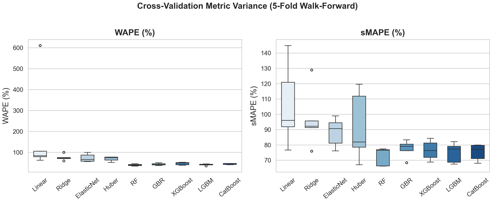

# 🛒 Olist Brazil — Weekly Revenue Forecasting & Market Expansion Scoring

[](https://www.python.org/)
[](https://scikit-learn.org/)
[](https://streamlit.io/)
[](LICENSE)

---

## 1. Project Title

**Olist Brazil — Weekly Revenue Forecasting & State-Level Market Expansion Scoring**

---

## 2. Overview

**What does this project do?**
Builds an end-to-end machine learning pipeline that forecasts weekly e-commerce revenue for each Brazilian state and ranks all 27 states by market expansion priority using the **Expansion Potential Score (EPS)**. The project features an interactive **Streamlit Dashboard** for COMPASS-XAI alignment and dynamic parameter tuning.

**What problem does it solve?**
E-commerce transaction data is often fragmented across fine-grained product categories or small geographic units, introducing noise and making forecasting unstable. This project aggregates records at the **state × week** level, producing a stable panel structure that reduces statistical noise and enables macro-level strategic decision-making.

**What is the main output?**
Next-week revenue forecasts per state, an EPS ranking visualized as a **dynamic choropleth heatmap** over the map of Brazil, and SHAP-based Explainable AI (XAI) reports.

---

## 3. Key Features

- 📊 **Weekly revenue forecasting** across 27 Brazilian states using Walk-Forward Cross-Validation
- 🤖 **Benchmarking of 9 regression models** — from Linear and Ridge to Random Forest, XGBoost, LightGBM, and CatBoost
- 🧩 **35 engineered features** including lag, rolling window, cyclical encoding, and macroeconomic indicators
- 🗺️ **Expansion Potential Score (EPS)** — a composite index combining Opportunity metrics (Demand, Growth, Momentum) and Risk (Logistics Cost)
- 🎛️ **Interactive Streamlit Dashboard** — real-time what-if scenario testing (Gamma penalty sweeps, Monte Carlo simulations) with a Dark Mode UI
- 🧠 **COMPASS-XAI Explanations** — integrating SHAP values to generate human-readable strategic narratives for market selection

---

## 4. Dataset / Input Data

- **Olist E-Commerce Dataset (Kaggle)**: Transaction data covering 2016–2018.  
  > 🔗 [kaggle.com/datasets/olistbr/brazilian-ecommerce](https://www.kaggle.com/datasets/olistbr/brazilian-ecommerce)

- **IBGE Socioeconomic Data (External)**: Population and GDP metrics by state.  
  > 🔗 Population: [br_ibge_populacao](https://basedosdados.org/dataset/d30222ad-7a5c-4778-a1ec-f0785371d1ca?table=b99f0017-e587-477e-8cfb-05fb5d1005b8)  
  > 🔗 GDP: [br_ibge_pib](https://basedosdados.org/dataset/fcf025ca-8b19-4131-8e2d-5ddb12492347?table=93007431-7ce9-42ee-8740-8c2274d345ad)

- **Brazil Geographic Boundaries (External)**: GeoJSON polygons for all 27 states.  
  > 🔗 [github.com/luizpedone/municipal-brazilian-geodata](https://github.com/ipeaGIT/geobr)

---

## 5. Project Structure

```text
├── app/
│   ├── streamlit_app.py              # Main interactive Streamlit dashboard
│   └── map_component/                # Custom Folium/GeoJSON mapping components
│
├── data/
│   ├── raw/olist/                    # Raw Olist CSV files from Kaggle
│   ├── external/                     # IBGE socioeconomic data + GeoJSON boundaries
│   └── processed/olist/              # Cleaned tables, engineered features, and forecasts
│
├── src/
│   ├── data/data_cleaning.py         # Bootstrap and clean all raw tables
│   ├── features/feature.py           # Build weekly state-level feature panel
│   ├── models/train_model.py         # Walk-forward CV, model selection, SHAP generation
│   └── analysis/expansion_scoring.py # EPS scoring, sensitivity analysis, XAI report
│
├── outputs/eps/
│   ├── eps_results.csv               # Final EPS rankings and component scores
│   ├── eps_xai_report.json           # LLM/XAI generated narrative reports for each state
│   └── w_star.json                   # Optimal component weights
│
├── reports/
│   ├── model_leaderboard.csv         # Table of model metrics (RMSE, MAE, etc.)
│   └── figures/
│       ├── cv_metrics_boxplot.png    # 5-fold CV variance boxplots
│       ├── fig2_choropleth.png       # Static map output
│       └── shap_rf.png               # SHAP feature importance for Random Forest
│
└── requirements.txt
```

---

## 6. Installation

```bash
# 1. Clone the repository
git clone https://github.com/<your-org>/<your-repo>.git
cd <your-repo>

# 2. Create and activate a virtual environment
python -m venv .venv
source .venv/bin/activate        # macOS / Linux
# .venv\Scripts\activate         # Windows

# 3. Install dependencies
pip install -r requirements.txt
```

---

## 7. How to Run

Place all data files in the correct directories before running:

```text
data/raw/olist/      ← all CSV files from Kaggle
data/external/       ← br_ibge_populacao_uf.csv, br_ibge_pib_uf.csv, br_states.geojson
```

### Data Pipeline & Modeling

Execute the pipeline steps in order to process data and generate outputs:

```bash
# Step 1 — Clean and validate all raw tables
python src/data/data_cleaning.py

# Step 2 — Build weekly state × week feature panel
python src/features/feature.py

# Step 3 — Train models, run walk-forward CV, and generate forecasts
python src/models/train_model.py

# Step 4 — Compute EPS rankings, run Monte Carlo/OAT, and generate XAI narratives
python src/analysis/expansion_scoring.py
```

### Interactive Streamlit Dashboard

To visualize the market expansion recommendations, explore the interactive map, and view SHAP-driven narratives:

```bash
streamlit run app/streamlit_app.py
```

---

## 8. Methodology / Approach

```text
Raw Data (Olist + IBGE)
        │
        ▼
  Data Cleaning          — handle nulls, duplicates, datetime parsing, zip code normalization
        │
        ▼
Feature Engineering      — 35 features: lag/rolling windows, growth rates,
        │                  cyclical encoding, market structure signals, IBGE macros
        ▼
Walk-Forward CV          — 5 folds, train on past weeks, validate on next week
        │                  prevents data leakage in time-series setting
        ▼
Model Selection          — benchmark 9 models, extract TreeExplainer SHAP from Random Forest
        │
        ▼
Revenue Forecasting      — Random Forest predicts week N+1 revenue for all 27 states
        │
        ▼
EPS Scoring & XAI        — combines forecast + growth + momentum + penetration
                           penalized by logistics risk. Generates XAI narratives.
```

**Updated EPS Formula:**

The Expansion Potential Score (EPS) uses a composite formula balancing Opportunity and Risk:

$$\text{Opportunity} = (w_{PD} \cdot PD + w_{GP} \cdot GP + w_{PG} \cdot PG + w_{MMI} \cdot MMI)$$
$$\text{Risk Penalty} = (1 - \gamma \cdot LC)$$
$$\text{EPS} = \text{Opportunity} \times \text{Risk Penalty}$$

*(Where PD: Predicted Demand, GP: Growth Potential, PG: Penetration Gap, MMI: Market Momentum Index, LC: Logistics Cost)*

**Weight Optimization Method:**

The component weights $w_{PD}, w_{GP}, w_{PG}, w_{MMI}$ are **not manually tuned** — they are found automatically by solving a constrained optimization problem using **SLSQP (Sequential Least Squares Programming)**. The objective is to **maximize the normalized Shannon entropy** of the Opportunity score distribution across all 27 Brazilian states:

$$\max_{w} \; H = -\frac{1}{\ln n} \sum_{s=1}^{n} p(s) \cdot \ln p(s) \quad \text{where } p(s) = \frac{\text{OPP}(s)}{\sum_{s'} \text{OPP}(s')}$$

Subject to:
- $\sum_{c} w_c = 1$ (weights sum to 1)
- $lo_c \leq w_c \leq hi_c$ for each component (bounded by domain-knowledge constraints)

This entropy-maximization objective ensures that the resulting EPS ranking **spreads states apart** as much as possible, avoiding degenerate cases where a single component dominates the ranking.

**Optimized Weights (for Brazil — Olist dataset):**

| Component | Weight ($w^*$) | Constraint Bounds | Description |
|---|---:|---|---|
| **PD** (Predicted Demand) | **0.2939** | [0.25, 0.45] | Demand signal from ML forecasts + recent revenue |
| **GP** (Growth Potential) | **0.2561** | [0.15, 0.35] | Short-term revenue growth rate |
| **PG** (Penetration Gap) | **0.3000** | [0.15, 0.30] | GDP-adjusted untapped market potential |
| **MMI** (Market Momentum) | **0.1500** | [0.05, 0.15] | Revenue efficiency per seller |
| **γ** (Risk Penalty) | **0.20** | — | Logistics cost penalty coefficient |

> 📌 These weights are saved in [`w_star.json`](outputs/eps/w_star.json) and validated via **Monte Carlo simulation** (10,000 iterations) and **OAT sensitivity sweeps** to confirm ranking robustness.

---

## 9. Evaluation Metrics

All models are evaluated using **5-Fold Walk-Forward Cross-Validation** — trained on historical weeks and validated on the immediately following week to prevent data leakage.

| Metric | Description |
|---|---|
| **RMSE** | Root Mean Squared Error (BRL) — lower is better |
| **MAE** | Mean Absolute Error (BRL) — lower is better |
| **WAPE(%)** | Weighted Absolute Percentage Error — lower is better |
| **SS_RMSE** | Skill Score relative to Baseline — higher is better |

**Latest 9-Model Benchmark Results:**

| Model | RMSE (BRL) | MAE (BRL) | WAPE(%) | sMAPE(%) |
|---|---:|---:|---:|---:|
| 🥇 **Random Forest** | **6,456** | **2,552** | **39.7%** | **72.7%** |
| 🥈 LightGBM | 6,798 | 2,679 | 41.2% | 75.0% |
| 🥉 Gradient Boosting | 7,297 | 2,835 | 43.5% | 77.5% |
| CatBoost | 7,549 | 2,871 | 44.1% | 75.2% |
| XGBoost | 7,999 | 2,996 | 46.6% | 76.5% |
| Huber Regressor | 13,129 | 4,394 | 69.0% | 91.8% |
| ElasticNet | 18,005 | 4,927 | 73.4% | 88.3% |
| Ridge | 18,226 | 4,940 | 75.6% | 96.8% |
| Linear (Baseline) | 34,361 | 9,696 | 188.5% | 106.1% |

<p align="center">
  
</p>

---

## 10. Limitations

| # | Limitation |
|---|---|
| 1 | **State-level granularity only** — city- or neighborhood-level analysis is not supported |
| 2 | **Online behavior proxy** — Olist purchase patterns may not reflect offline retail activity |
| 3 | **Narrow time window** — data covers 2016–2018 only; Brazil's e-commerce landscape has changed substantially since then |
| 4 | **Slow-moving macro variables** — IBGE GDP and population capture long-term structural differences but contribute little to short-term weekly fluctuations |
| 5 | **EPS as a decision-support tool** — the index is quantitative and should be combined with qualitative field research before finalizing any expansion decisions |
