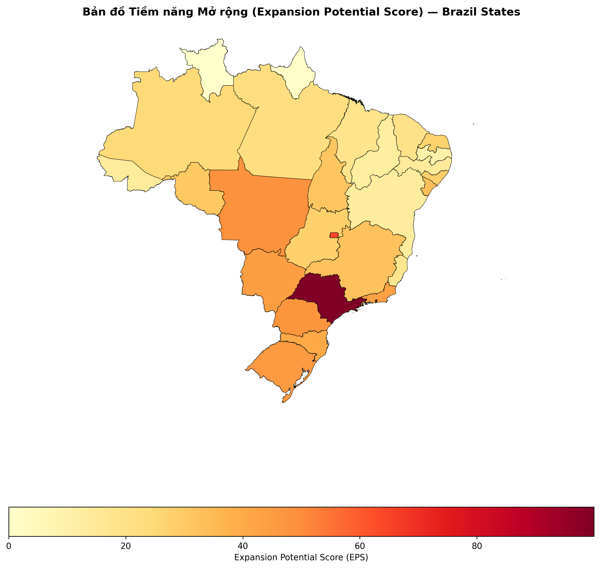
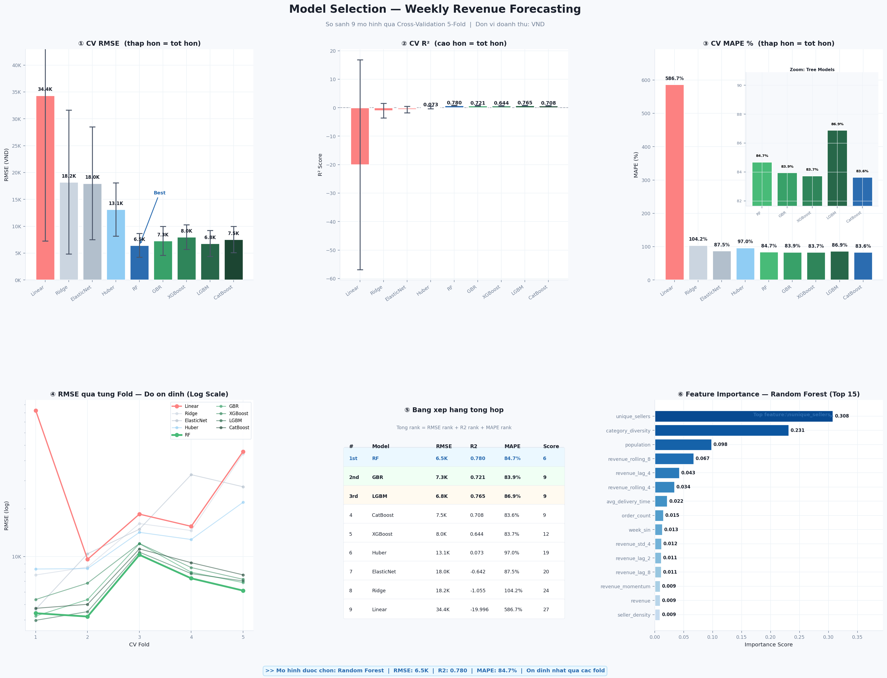

# 🛒 Olist Brazil — Weekly Revenue Forecasting & Market Expansion Scoring

[](https://www.python.org/)
[](https://scikit-learn.org/)
[](https://lightgbm.readthedocs.io/)
[](LICENSE)

---

## 1. Project Title

**Olist Brazil — Weekly Revenue Forecasting & State-Level Market Expansion Scoring**

---

## 2. Overview

**What does this project do?**
Builds an end-to-end machine learning pipeline that forecasts weekly e-commerce revenue for each Brazilian state and ranks all 27 states by market expansion priority using the **Expansion Potential Score (EPS)**.

**What problem does it solve?**
E-commerce transaction data is often fragmented across fine-grained product categories or small geographic units, introducing noise and making forecasting unstable. This project aggregates records at the **state × week** level, producing a stable panel structure that reduces statistical noise and enables macro-level strategic decision-making.

**What is the main output?**
Next-week revenue forecasts per state and an EPS ranking visualized as a **choropleth heatmap** over the map of Brazil.

---

## 3. Key Features

- 📊 **Weekly revenue forecasting** across 27 Brazilian states using Walk-Forward Cross-Validation
- 🤖 **Benchmarking of 9 regression models** — from Linear and Ridge to Random Forest, XGBoost, LightGBM, and CatBoost
- 🧩 **35 engineered features** including lag, rolling window, cyclical encoding, and macroeconomic indicators
- 🗺️ **Expansion Potential Score (EPS)** — a 6-component composite index scoring each state's market attractiveness
- 🖼️ **Automated report generation** — model comparison dashboard, feature correlation matrix, and choropleth heatmap

---

## 4. Dataset / Input Data

### Olist E-Commerce Dataset *(Kaggle)*
> 🔗 [kaggle.com/datasets/olistbr/brazilian-ecommerce](https://www.kaggle.com/datasets/olistbr/brazilian-ecommerce)

Transaction data covering 2016–2018, comprising 8 core tables:

| Table | Description |
|---|---|
| `olist_orders_dataset.csv` | Order lifecycle status and timestamps |
| `olist_order_items_dataset.csv` | Product price, freight cost, and seller |
| `olist_customers_dataset.csv` | Customer location and unique ID |
| `olist_sellers_dataset.csv` | Seller location |
| `olist_order_payments_dataset.csv` | Payment method, installments, and value |
| `olist_order_reviews_dataset.csv` | Customer review scores and comments |
| `olist_products_dataset.csv` | Product category and physical attributes |
| `product_category_name_translation.csv` | Portuguese to English category name mapping |

### IBGE Socioeconomic Data *(External)*
> 🔗 Population: [sidra.ibge.gov.br/tabela/6579](https://sidra.ibge.gov.br/tabela/6579)
> 🔗 GDP: [ibge.gov.br — Contas Regionais](https://www.ibge.gov.br/estatisticas/economicas/contas-nacionais/9054-contas-regionais-do-brasil.html)

| File | Description |
|---|---|
| `br_ibge_populacao_uf.csv` | Annual population count by state |
| `br_ibge_pib_uf.csv` | GDP metrics by state |

### Brazil Geographic Boundaries *(External)*
> 🔗 [github.com/luizpedone/municipal-brazilian-geodata](https://github.com/luizpedone/municipal-brazilian-geodata)

| File | Description |
|---|---|
| `br_states.geojson` | Geographic boundary polygons for all 27 states, used for choropleth map rendering |

---

## 5. Project Structure

```
├── data/
│   ├── raw/olist/                    # Raw Olist CSV files from Kaggle
│   ├── external/                     # IBGE socioeconomic data + GeoJSON boundaries
│   └── processed/olist/              # Cleaned tables, engineered features, and outputs
│
├── notebooks/
│   ├── data_cleaning.ipynb           # Raw data inspection and preprocessing
│   ├── eda.ipynb                     # Exploratory analysis and visualizations
│   ├── modeling.ipynb                # Model training and walk-forward CV evaluation
│   └── eps_state_week_scoring.ipynb  # EPS computation and market ranking
│
├── src/
│   ├── data/data_cleaning.py         # Bootstrap and clean all raw tables
│   ├── features/feature.py           # Build weekly state-level feature panel
│   ├── models/train_model.py         # Walk-forward CV, model selection, forecasting
│   └── analysis/expansion_scoring.py # EPS scoring and report generation
│
├── reports/
│   ├── model_comparison.png          # 9-model performance comparison dashboard
│   ├── feature_correlation.png       # Correlation heatmap of all 35 features
│   └── figures/
│       ├── eps_state_heatmap.png     # Choropleth map of EPS scores across Brazil
│       └── eps_state_ranking_bar.png # Bar chart ranking all 27 states by EPS
│
└── requirements.txt
```

---

## 6. Installation

```bash
# 1. Clone the repository
git clone https://github.com/<your-org>/<your-repo>.git
cd <your-repo>

# 2. Create and activate a virtual environment
python -m venv .venv
source .venv/bin/activate        # macOS / Linux
# .venv\Scripts\activate         # Windows

# 3. Install dependencies
pip install -r requirements.txt
```

**requirements.txt**
```
pandas>=2.0
numpy>=1.24
scikit-learn>=1.3
lightgbm>=4.0
xgboost>=2.0
catboost>=1.2
geopandas>=0.14
matplotlib>=3.7
seaborn>=0.12
jupyter>=1.0
```

---

## 7. How to Run

Place all data files in the correct directories before running:

```
data/raw/olist/      ← all CSV files from Kaggle
data/external/       ← br_ibge_populacao_uf.csv, br_ibge_pib_uf.csv, br_states.geojson
```

Then execute the pipeline steps in order:

```bash
# Step 1 — Clean and validate all raw tables
python src/data/data_cleaning.py

# Step 2 — Build weekly state × week feature panel
python src/features/feature.py

# Step 3 — Train models, run walk-forward CV, and generate forecasts
python src/models/train_model.py

# Step 4 — Compute EPS rankings and generate report visuals
python src/analysis/expansion_scoring.py
```

Customize EPS weights via CLI:

```bash
python src/analysis/expansion_scoring.py \
  --rolling-window 4 \
  --w-pd 0.40 --w-gp 0.20 --w-ms 0.15 \
  --w-pg 0.15 --w-si 0.05 --w-lc 0.05
```

---

## 8. Methodology / Approach

```
Raw Data (Olist + IBGE)
        │
        ▼
  Data Cleaning          — handle nulls, duplicates, datetime parsing, zip code normalization
        │
        ▼
Feature Engineering      — 35 features: lag/rolling windows, growth rates,
        │                  cyclical encoding, market structure signals, IBGE macros
        ▼
Walk-Forward CV          — 5 folds, train on past weeks, validate on next week
        │                  prevents data leakage in time-series setting
        ▼
Model Selection          — benchmark 9 models, select by composite RMSE + R² + MAPE rank
        │
        ▼
Revenue Forecasting      — Random Forest predicts week N+1 revenue for all 27 states
        │
        ▼
EPS Scoring              — combines forecast + growth + market size
                           + penetration gap − seller intensity − logistics cost
```

**EPS Formula:**

$$\text{EPS} = 0.35 \cdot PD + 0.20 \cdot GP + 0.20 \cdot MS + 0.15 \cdot PG - 0.05 \cdot SI - 0.05 \cdot LC$$

---

## 9. Results / Output

The pipeline produces 2 data files and 4 report visuals:

| Output | Path |
|---|---|
| Next-week revenue forecasts | `data/processed/olist/predicted_next_week_revenue.csv` |
| EPS state rankings | `data/processed/olist/eps_state_ranking.csv` |
| Model comparison dashboard | `reports/model_comparison.png` |
| Feature correlation heatmap | `reports/feature_correlation.png` |
| **EPS choropleth heatmap** | `reports/figures/eps_state_heatmap.png` |
| EPS ranking bar chart | `reports/figures/eps_state_ranking_bar.png` |

<p align="center">
  
</p>

> São Paulo (SP) leads due to its deep seller ecosystem and highest predicted demand. Northern and Northeastern states show large penetration gaps — significant untapped growth potential.

---

## 10. Evaluation Metrics

All models are evaluated using **5-Fold Walk-Forward Cross-Validation** — trained on historical weeks and validated on the immediately following week to prevent data leakage.

| Metric | Description |
|---|---|
| **RMSE** | Absolute forecast error in BRL — lower is better |
| **R²** | Proportion of variance explained — higher is better |
| **MAPE** | Mean absolute percentage error — lower is better |

**9-Model Benchmark Results:**

| Rank | Model | RMSE (BRL) | R² | MAPE |
|:---:|---|---:|---:|---:|
| 🥇 1 | **Random Forest** | **6,500** | **0.780** | **84.7%** |
| 🥈 2 | Gradient Boosting | 7,300 | 0.721 | 83.9% |
| 🥉 3 | LightGBM | 6,800 | 0.765 | 86.9% |
| 4 | CatBoost | 7,500 | 0.708 | 83.6% |
| 5 | XGBoost | 8,000 | 0.644 | 83.7% |
| 6 | Huber | 13,100 | 0.073 | 97.0% |
| 7 | ElasticNet | 18,000 | −0.642 | 87.5% |
| 8 | Ridge | 18,200 | −1.055 | 104.2% |
| 9 | Linear | 34,400 | −19.996 | 586.7% |

<p align="center">
  
</p>

---

## 11. Limitations

| # | Limitation |
|---|---|
| 1 | **State-level granularity only** — city- or neighborhood-level analysis is not supported |
| 2 | **Online behavior proxy** — Olist purchase patterns may not reflect offline retail activity |
| 3 | **Narrow time window** — data covers 2016–2018 only; Brazil's e-commerce landscape has changed substantially since then |
| 4 | **Slow-moving macro variables** — IBGE GDP and population capture long-term structural differences but contribute little to short-term weekly fluctuations |
| 5 | **Seller intensity as a proxy** — local seller density does not capture competition from brick-and-mortar retail channels |
| 6 | **EPS as a decision-support tool** — the index is quantitative and should be combined with qualitative field research before finalizing any expansion decisions |