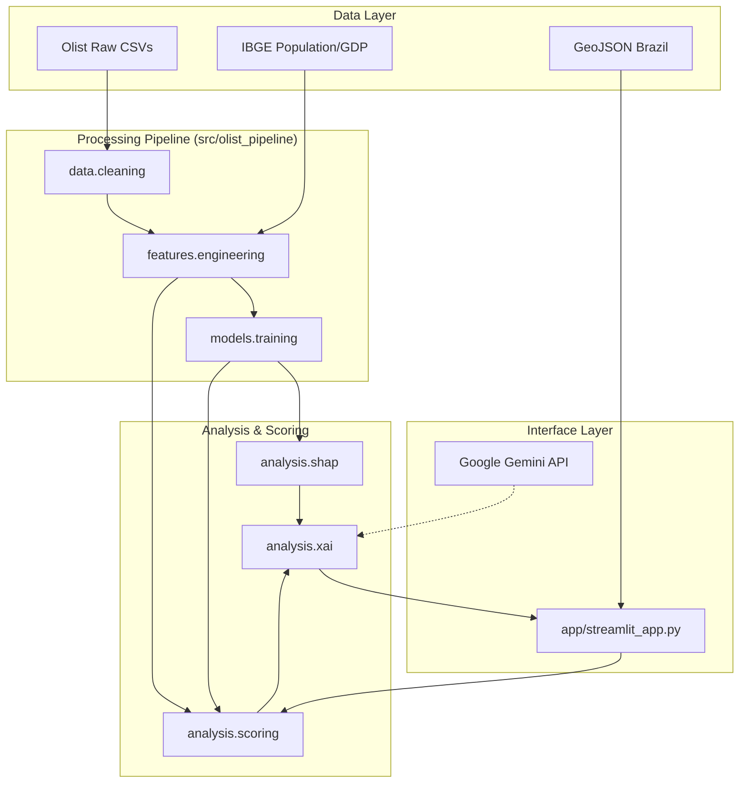
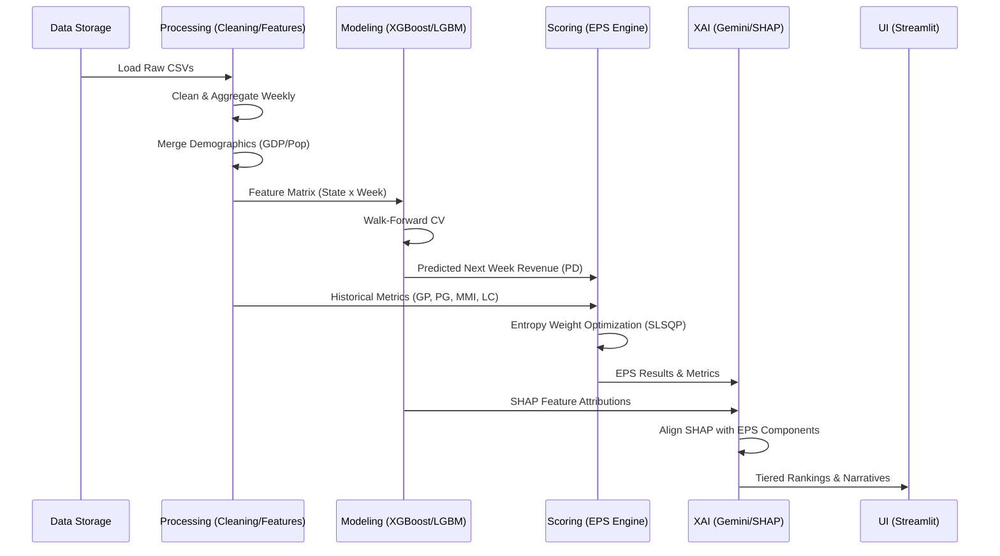

# Technical Design Document: COMPASS-XAI E-Commerce Expansion Pipeline

## 1. System Overview
**COMPASS-XAI** (COMPosite market expansion scoring with Aligned SHAP explanations) is an end-to-end machine learning and analytics platform designed to prioritize geographic expansion for e-commerce in Brazil. Using the Olist dataset enriched with IBGE demographic data, the system predicts demand and calculates an **Expansion Priority Score (EPS)** to rank Brazilian states.

---

## 2. System Architecture
The system is built with a modular, config-driven architecture that separates data processing, model training, and analytical scoring.

### 2.1 Component Diagram

---

## 3. Data Flow Diagram
The transformation from raw transaction data to actionable business insights follows a strictly decoupled path.

---

## 4. Package Documentation

### `src.olist_pipeline.core`
The backbone of the system.
- **`config.py`**: Uses Pydantic for strict validation of YAML-based configurations (`paths.yaml`, `training.yaml`, `inference.yaml`).
- **`exceptions.py`**: Custom domain exceptions for configuration and pipeline failures.

### `src.olist_pipeline.data`
- **`cleaning.py`**: Orchestrates the ingestion of Olist data (via KaggleHub) and performs domain-specific cleaning (filtering for delivered orders, handling missing physical dimensions).

### `src.olist_pipeline.features`
- **`engineering.py`**: Transforms transactional data into a **State-Week Panel**.
    - **Temporal**: Seasonality (Sin/Cos), Year-Week periods.
    - **Demographic**: Joins with IBGE data for per-capita metrics.
    - **Dynamics**: Rolling averages (4w, 8w), Lags, and Growth rates.

### `src.olist_pipeline.models`
- **`training.py`**: A rigorous benchmarking suite evaluating 9 regressors.
    - Employs **TimeSeriesSplit** (Walk-forward) to prevent temporal leakage.
    - Outputs model leaderboards and selection logic.

### `src.olist_pipeline.analysis`
- **`scoring.py`**: The EPS Engine. Calculates the five core components:
    - **PD (Predicted Demand)**: Short-term forecast + Recent actuals.
    - **GP (Growth Potential)**: Current cycle vs. Previous cycle.
    - **PG (Penetration Gap)**: Expected vs. Actual revenue based on GDP/Pop.
    - **MMI (Market Momentum)**: Revenue efficiency per seller.
    - **LC (Logistics Cost)**: Normalized freight risk factor.
- **`shap.py`**: Deep-dives into the "why" of Predicted Demand, identifying which features (e.g., revenue_lag_1, population) drove the forecast.
- **`xai.py`**: Synthesizes rule-based logic with Gemini LLM to produce "COMPASS-XAI" narratives.

---

## 5. Training and Inference Workflow

### Training Workflow
1. **Feature Generation**: Run `run_features.py` to create the training set.
2. **Model Benchmarking**: Run `run_training.py`. It trains Ridge, RF, XGB, LGBM, etc.
3. **Model Selection**: The model with the best Skill Score (SS_RMSE) is promoted.
4. **Attribution**: `run_shap.py` generates global and state-level SHAP profiles.

### Scoring/Inference Workflow
1. **Forecast**: Best model predicts revenue for $T+1$.
2. **Component Calculation**: Compute PD, GP, PG, MMI, LC for all states.
3. **Weight Optimization**: Use Shannon Entropy Maximization to find weights that maximize information gain across components.
4. **EPS Ranking**: Apply weights and the Gamma ($\gamma$) risk penalty to generate the final 1-27 ranking.
5. **Narrative Generation**: XAI pipeline combines EPS metrics and SHAP scores to explain the rank.

---

## 6. Streamlit Dashboard Architecture
The dashboard serves as a Decision Support System (DSS) with:
- **Reactive Engine**: Real-time recalculation of EPS scores when users adjust sliders for weights or the Gamma penalty.
- **Custom Components**: A dedicated `map_selector` using Plotly/MapLibre for interactive state selection.
- **Visualizations**: 
    - **Radar Charts**: Component profiles for specific states.
    - **Combo Charts**: Grouped bars for contributions vs. risk line.
    - **Sensitivity Analysis**: Visualizes how rankings change under noise or weight shifts.

---

## 7. Model Lifecycle & XAI Alignment
The unique value proposition of this architecture is the **Alignment Layer**.
- **The Gap**: Traditional scoring systems (like EPS) use business heuristics, while ML models (like XGBoost) use data patterns.
- **The Solution**: `analysis.shap` calculates the "ML view" and `analysis.xai` compares it to the "Business view" (EPS components). The alignment score indicates if the machine-predicted demand is consistent with the business-logic expansion criteria.

---

## 8. Suggestions for Production Deployment

### 1. Containerization
Wrap the pipeline and Streamlit app in **Docker**. Use a multi-stage build to keep the frontend image lean.

### 2. Orchestration
Use **Apache Airflow** or **Prefect** to manage the pipeline.
- *DAG 1*: Data Ingestion & Cleaning (Weekly).
- *DAG 2*: Feature Engineering & Forecasting (Weekly).
- *DAG 3*: Model Re-training (Monthly).

### 3. Model Registry
Integrate **MLflow** to track experiments, model versions, and SHAP visualizations.

### 4. API Layer
Expose the scoring logic via **FastAPI**. This allows external BI tools or CRM systems to consume EPS scores without loading the entire Streamlit app.

### 5. Monitoring
Implement **Data Drift** monitoring (using `evidently` or `alibi-detect`) to alert when Brazilian e-commerce patterns shift significantly from the training period (2016-2018).
